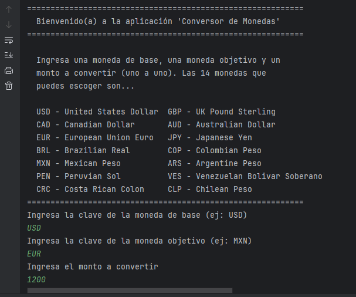
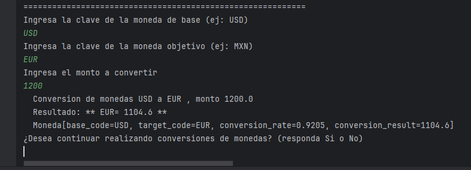
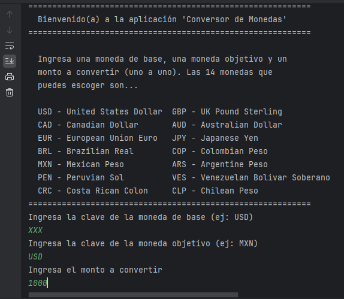
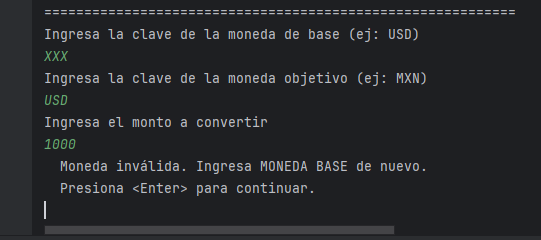
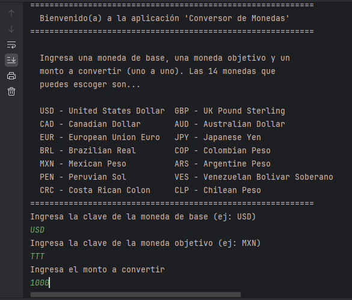
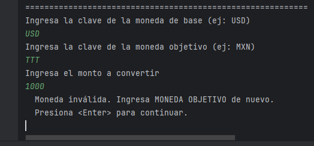
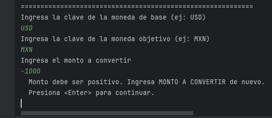

# Proyecto - Conversor de Monedas (Java)

Este proyecto es parte del desafío final de la formación **Oracle One - Java Orientado a Objetos**, ofrecida por la plataforma educativa **Alura Latam**.
Es una aplicación de consola que sirve como Conversor de Monedas. La aplicación permite al usuario realizar conversiones entre catorce divisas populares, americanas e internacionales, seleccionadas a partir de las monedas utilizadas en la API externa **ExchangeRate-API**.
Al final de las operaciones, la aplicación guarda los resultados en archivos locales con formato JSON.

## Funcionalidades
Se permite convertir, entre pares de monedas, a partir de la siguiente lista de catorce monedas:

  **USD** - Dólar de Estados Unidos
  **GBP** - Libra Esterlina de United Kingdom
  **CAD** - Dólar Canadiense
  **AUD** - Dólar Australiano
  **EUR** - Euro de la Unión Europea
  **JPY** - Yen Japonés
  **BRL** - Real Brasileño
  **COP** - Peso Colombiano
  **MXN** - Peso Mexicano
  **ARS** - Peso Argentino
  **PEN** - Sol Peruano
  **VES** - Bolívar Soberano Venezolano
  **CRC** - Colón de Costa Rica
  **CLP** - Peso Chileno

Por cada conversión de monedas se guarda un archivo JSON con la operación realizada.

## Requisitos
- Java SDK (Software Development Kit) version 17 o superior instalado y configurado localmente.
- IDE o Entorno de Desarrollo Integrado para proyectos Java (por ejemplo: IntelliJ Idea, Eclipse, Netbeans).
- Registrarse en la API web de ExchangeRate; obtener la propia API key.
- Bibliotecas Java HttpRequest, HttpResponse, FileWriter.
- Instalar biblioteca externa gson de Google (manejo de formato JSON).

## Obtener código del siguiente enlace
- https://github.com/jcmunav63/conversor_monedas.git

## Estructura del Proyecto
Principal (Main) En esta clase se muestran las opciones que el usuario puede elegir para convertir su moneda. Esta clase está enlazada con la clase ConsultaApi para obtener datos actualizados desde la API.
ConsultaApi Esta clase maneja la conexión a una API externa de conversión de monedas. Recibe como parámetros la moneda base y la moneda objetivo, y devuelve un objeto ResultadoDelCambio con los detalles de la conversión. Además, se encarga de manejar posibles errores en la conexión y respuestas inesperadas de la API.
GeneradorDeArchivos En esta clase se implementa la lógica para guardar los datos de las conversiones en formato JSON. Permite tanto guardar nuevos resultados como cargar el historial de conversiones previas. Se proporciona funcionalidad para verificar si el archivo ya existe y, en caso afirmativo, agregar datos sin sobrescribir el historial anterior.

## Imágenes de la aplicación
A continuación se presentan algunos ejemplos de operaciones de conversión entre pares de monedas, incluyendo el menú principal de la aplicación, los resultados exitosos, y el manejo de algunos mensajes de error.

- Menú principal 'Conversor de Monedas'

  
   

- Resultado de convertir 1200 USD a EUR

  
   

- Ingresando moneda base inválida 

  
  
   

- Ingresando moneda objetivo inválida 

  
  
   

- Ingresando monto a convertir inválido 

  
   

